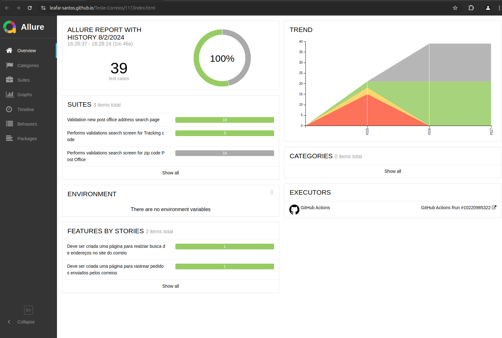
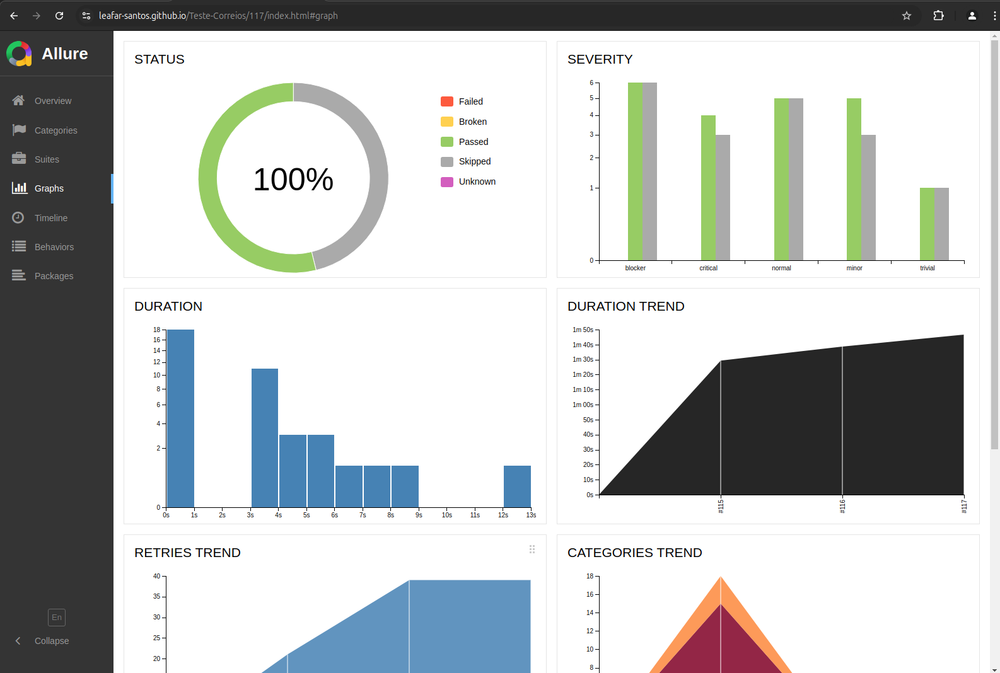

# Projeto de testes Web Selenium, Java 21, Junit 5, com Integraçao com git Actions e com Allure Reports.

Veja como usar implementar os testes e o Allure nos passos após as imagens.

<figure>
  
</figure>

<figure>
  
  <figcaption>Gráficos para análises</figcaption>
</figure>

<ol>
<li><strong>Apache Maven 3.6.3</strong></li>
    sudo apt install maven

<li><strong>NPM 8.5.1</strong></li>
    sudo apt-get install npm

<li><strong>Allure 2.22.0</strong></li>
<strong>Obs.: </strong>Allure requires Java 8 or higher 
npm install -g allure-commandline --save-dev

<li><strong>Propriedades necessárias para configuração do projeto, inserir no properties.</strong></li>

</ol>

<strong>Bibliotecas necessárias para a execução  do projeto</strong>

    <dependency>
            <groupId>io.qameta.allure</groupId>
            <artifactId>allure-junit5</artifactId>
            <version>2.21.0</version>
            <scope>test</scope>
        </dependency>

        <dependency>
            <groupId>org.junit.jupiter</groupId>
            <artifactId>junit-jupiter-api</artifactId>
            <version>5.9.2</version>
        </dependency>

        <dependency>
            <groupId>org.junit.jupiter</groupId>
            <artifactId>junit-jupiter-engine</artifactId>
            <version>5.9.2</version>
        </dependency>

        <dependency>
            <groupId>org.hamcrest</groupId>
            <artifactId>hamcrest</artifactId>
            <version>2.2</version>
        </dependency>

        <dependency>
            <groupId>org.junit.jupiter</groupId>
            <artifactId>junit-jupiter-params</artifactId>
            <version>5.9.2</version>
        </dependency>

        <!-- Dependencias JUnit para criar suites de testes -->
        <dependency>
            <groupId>org.junit.vintage</groupId>
            <artifactId>junit-vintage-engine</artifactId>
            <version>5.9.2</version>
        </dependency>

        <dependency>
            <groupId>org.junit.platform</groupId>
            <artifactId>junit-platform-runner</artifactId>
            <version>1.9.2</version>
        </dependency>

<ol>
<li><strong>Executando projeto</strong></li>
Para executar o projeto, no terminal digite: 
mvn clean test

<li><strong>Gerar o relatório</strong></li>
Para visualizar report, no terminal digite: 
allure generate

<li><strong>Abrir relatório</strong></li>
Em seguida digite: allure open
</ol>

			
